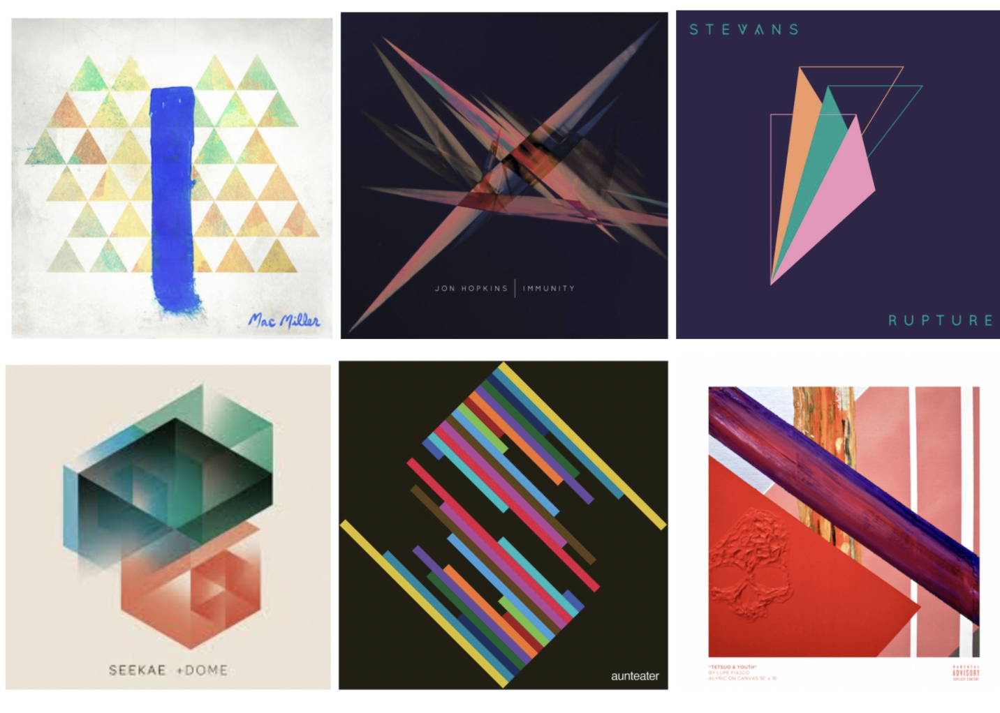
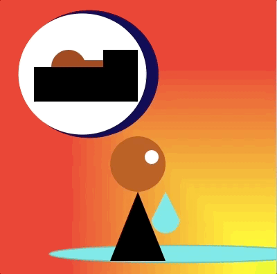

# Abstract Album Art Project
In Fine Art, we often use abstraction to represent complex feelings, emotions, and moods by using shapes, strokes, and convey those feelings.

For some people with a condition called synesthesia, this is how they experience the world all the time. While scientists don't completely understand synesthesia, the rare phenomenon causes people to experience two senses at once. For example, when people hear music, they might also "see" colors. Or when they taste a flavor, they might also hear a certain tone.

## GOAL
For our Unit 1 Project, you will select a favorite song or album and create an abstract album cover to represent the mood, emotions, and feelings in the  song/album.

**Your final album cover should contain:**

1. Use shapes that we covered in this unit (ellipse, rect, triangle, etc.)
2. Use built in variables
3. Create & use custom variables to control two or more elements of your design
4. Have your design change slightly each time it is run by using the random feature with some of your custom variables.(e.g. have parts of your design move slightly each time the program is run)

